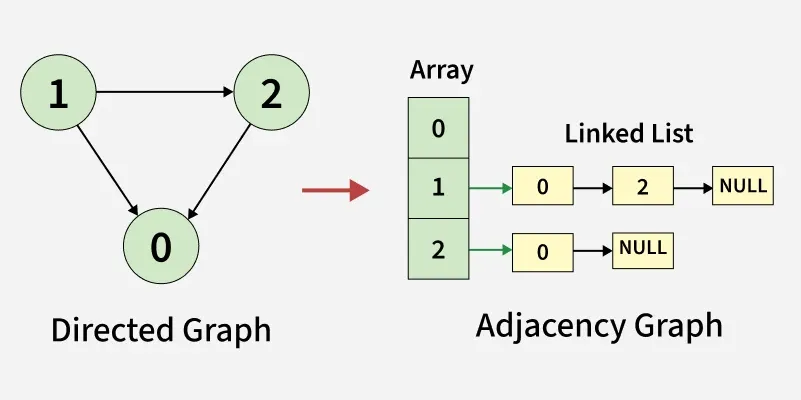

The adjacency list is a concept where we use array of linked list in order to represent vertices of a graph. Each element denotes a vertex and the linked list present at the same index contains all the vertices that are directly connected to the vertex represented by the given element.

Create an array of linked lists (or arrays of arrays) of size V, where V is the number of vertices.
For each edge in the graph, add the destination vertex to the list of the source vertex.
If the graph is undirected, add the source vertex to the list of the destination vertex as well.
If the graph is weighted, modify each element in the list to store a pair of values: the destination vertex and the weight of the edge.

