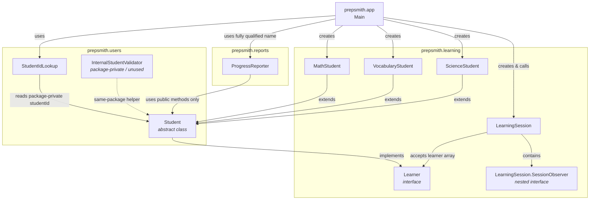

# PrepSmith architecture

```mermaid
flowchart TD
    Main["prepsmith.app<br/>Main"]

    subgraph Users["prepsmith.users"]
        Student["Student<br/><i>abstract class</i>"]
        Lookup["StudentIdLookup"]
        Validator["InternalStudentValidator<br/><i>package-private / unused</i>"]
    end

    subgraph Learning["prepsmith.learning"]
        Learner["Learner<br/><i>interface</i>"]
        Session["LearningSession"]
        Observer["LearningSession.SessionObserver<br/><i>nested interface</i>"]
        Math["MathStudent"]
        Vocab["VocabularyStudent"]
        Science["ScienceStudent"]
    end

    subgraph Reports["prepsmith.reports"]
        Reporter["ProgressReporter"]
    end

    Main -->|creates| Math
    Main -->|creates| Vocab
    Main -->|creates| Science
    Main -->|creates & calls| Session
    Main -->|uses| Lookup
    Main -->|uses fully qualified name| Reporter

    Student -->|implements| Learner
    Math -->|extends| Student
    Vocab -->|extends| Student
    Science -->|extends| Student

    Session -->|accepts learner array| Learner
    Session -->|contains| Observer

    Lookup -->|reads package-private studentId| Student
    Validator -.->|same-package helper| Student
    Reporter -->|uses public methods only| Student
```
